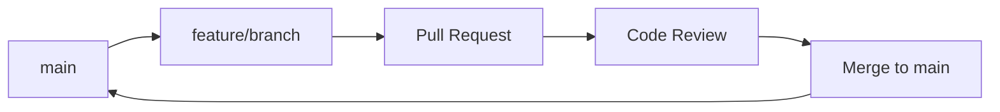
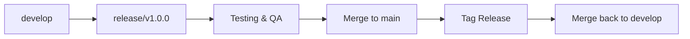

# Branching Strategy 🌿

This document outlines our Git branching strategy and workflow for the TimeLock project. Following these guidelines ensures clean, organized, and efficient development.

## 📋 Table of Contents

- [Branch Types](#branch-types)
- [Branch Naming Convention](#branch-naming-convention)
- [Workflow Overview](#workflow-overview)
- [Detailed Workflows](#detailed-workflows)
- [Merge Strategies](#merge-strategies)
- [Branch Management](#branch-management)
- [Best Practices](#best-practices)

## Branch Types

### Main Branches

#### `main` (Production)
- **Purpose**: Production-ready code
- **Protection**: Always protected, requires PR approval
- **Merging**: Only from `release` branches or hotfixes
- **Deployment**: Automatically deploys to production

#### `develop` (Development)
- **Purpose**: Integration branch for features
- **Protection**: Protected, requires PR approval
- **Merging**: Features merge here first
- **Stability**: Should always be stable

### Supporting Branches

#### `feature/*` (Features)
- **Purpose**: New features and enhancements
- **Lifetime**: Short-lived, deleted after merge
- **Source**: Branch from `develop` or `main`
- **Target**: Merge back to `develop` or `main`

#### `fix/*` (Bug Fixes)
- **Purpose**: Bug fixes and patches
- **Lifetime**: Short-lived, deleted after merge
- **Source**: Branch from affected branch
- **Target**: Merge to appropriate branch

#### `hotfix/*` (Hotfixes)
- **Purpose**: Critical production fixes
- **Lifetime**: Very short-lived
- **Source**: Branch from `main`
- **Target**: Merge to `main` and `develop`

#### `release/*` (Releases)
- **Purpose**: Release preparation and testing
- **Lifetime**: Medium-lived, deleted after release
- **Source**: Branch from `develop`
- **Target**: Merge to `main` and `develop`

#### `docs/*` (Documentation)
- **Purpose**: Documentation updates and guides
- **Lifetime**: Medium-lived, can persist
- **Source**: Branch from `main`
- **Target**: Merge to `main`

#### `styling/*` (Styling)
- **Purpose**: UI/UX improvements and style refactoring
- **Lifetime**: Medium-lived
- **Source**: Branch from `main`
- **Target**: Merge to `main`

## Branch Naming Convention

### Format
```
<type>/<description>
```

### Types
- `feature/` - New features
- `fix/` - Bug fixes
- `hotfix/` - Critical production fixes
- `release/` - Release branches
- `docs/` - Documentation
- `styling/` - Styling improvements
- `refactor/` - Code refactoring
- `test/` - Testing improvements

### Description Rules
- Use lowercase letters
- Use hyphens to separate words
- Be descriptive but concise
- Start with verb for features/fixes

### Examples
```
✅ Good:
feature/add-calendar-export
fix/timezone-display-issue
styling/improve-button-designs
docs/update-contribution-guide
hotfix/critical-calendar-crash

❌ Bad:
feature/new-feature
fix/bug
styling/fix
docs/guide
hotfix/fix
```

## Workflow Overview

### Standard Feature Development



### Release Process



## Detailed Workflows

### Feature Development

#### 1. Create Feature Branch
```bash
# From main (for small features)
git checkout main
git pull origin main
git checkout -b feature/add-calendar-export

# Or from develop (for larger features)
git checkout develop
git pull origin develop
git checkout -b feature/multi-calendar-view
```

#### 2. Develop and Commit
```bash
# Make changes
# Test thoroughly
git add .
git commit -m "feat: add calendar export functionality

- Implement selective task export
- Add duplicate prevention
- Update UI with export options
- Add success/error messaging"
```

#### 3. Keep Updated
```bash
# Regularly sync with main
git fetch origin
git rebase origin/main
# Or merge if conflicts
git merge origin/main
```

#### 4. Create Pull Request
```bash
# Push branch
git push -u origin feature/add-calendar-export

# Create PR on GitHub with:
# - Clear title and description
# - Link to related issues
# - Screenshots/videos if UI changes
# - Testing instructions
```

### Bug Fix Workflow

#### Critical Bug (Hotfix)
```bash
# Branch from main
git checkout main
git pull origin main
git checkout -b hotfix/critical-calendar-crash

# Fix the issue
# Test the fix
git add .
git commit -m "fix: resolve calendar crash on iOS 17

- Fix null pointer in calendar sync
- Add proper error handling
- Update iOS compatibility"

# Push and create PR
git push -u origin hotfix/critical-calendar-crash
```

#### Regular Bug Fix
```bash
# Branch from main or develop
git checkout main
git checkout -b fix/timezone-display-issue

# Fix and commit
git commit -m "fix: display correct local time instead of UTC

- Update date formatting to use local timezone
- Fix calendar header time display
- Add timezone tests"
```

### Documentation Workflow

```bash
# Create docs branch
git checkout main
git checkout -b docs/update-development-guide

# Update documentation
# Commit changes
git add docs/
git commit -m "docs: update development guide

- Add new branching strategy section
- Update setup instructions
- Add troubleshooting guide"

# Push and create PR
git push -u origin docs/update-development-guide
```

### Styling Workflow

```bash
# Create styling branch
git checkout main
git checkout -b styling/refactor-component-styles

# Extract styles to separate files
# Update imports
# Test UI consistency
git add .
git commit -m "style: extract component styles to dedicated files

- Create styles/components/ directory
- Extract TaskCard, PageHeader, EmptyState styles
- Update component imports
- Verify no TypeScript errors"

# Push and create PR
git push -u origin styling/refactor-component-styles
```

## Merge Strategies

### Merge vs Rebase

#### When to Use Merge
- **Feature branches** with multiple commits
- **Long-running branches** with frequent updates
- **When you want to preserve** commit history
- **Team preference** for clear merge commits

#### When to Use Rebase
- **Short-lived branches** with few commits
- **Keeping history clean** (linear history)
- **Before merging** to avoid merge commits
- **When working alone** on feature

### Examples

#### Merge Strategy
```bash
# On feature branch
git checkout main
git pull origin main
git checkout feature/my-feature
git merge main  # Creates merge commit

# Or from GitHub PR interface
```

#### Rebase Strategy
```bash
# On feature branch
git fetch origin
git rebase origin/main  # Replays commits on top of main

# Force push (required after rebase)
git push -f origin feature/my-feature
```

## Branch Management

### Cleaning Up Branches

#### After Successful Merge
```bash
# Delete local branch
git branch -d feature/completed-feature

# Delete remote branch
git push origin --delete feature/completed-feature

# Or delete from GitHub after PR merge
```

#### Finding Stale Branches
```bash
# List merged branches
git branch --merged main

# List unmerged branches
git branch --no-merged main

# Delete multiple branches
git branch -D branch1 branch2 branch3
```

### Branch Status Commands

```bash
# Current branch
git branch --show-current

# All branches with last commit
git branch -v

# Branches and their tracking
git branch -vv

# Remote branches
git branch -r
```

## Best Practices

### Commit Messages

#### Format
```
type(scope): description

[optional body]

[optional footer]
```

#### Types
- `feat:` - New features
- `fix:` - Bug fixes
- `docs:` - Documentation
- `style:` - Code style changes
- `refactor:` - Code refactoring
- `test:` - Testing
- `chore:` - Maintenance

#### Examples
```
feat: add calendar export functionality
fix: resolve timezone display issue
docs: update branching strategy guide
style: format code with prettier
refactor: extract calendar sync service
test: add calendar export unit tests
chore: update dependencies
```

### Pull Request Guidelines

#### PR Title
- Clear and descriptive
- Include type prefix
- Reference issue number if applicable

#### PR Description
- **What**: What changes were made
- **Why**: Why these changes are needed
- **How**: How to test the changes
- **Screenshots**: For UI changes
- **Breaking Changes**: If any

#### PR Checklist
- [ ] Code follows style guide
- [ ] Tests pass
- [ ] Documentation updated
- [ ] No console errors
- [ ] Tested on iOS/Android/Web
- [ ] Accessibility considered

### Branch Hygiene

#### Regular Maintenance
```bash
# Update main regularly
git checkout main
git pull origin main

# Clean up old branches
git branch -d $(git branch --merged | grep -v main)

# Prune remote branches
git remote prune origin
```

#### Avoid Common Issues
- **Don't commit to main directly** - always use branches
- **Keep branches short-lived** - merge within 1-2 weeks
- **Regular rebasing** - stay updated with main
- **Descriptive names** - make branches searchable
- **Delete after merge** - keep repository clean

### Conflict Resolution

#### During Rebase
```bash
# If conflicts occur during rebase
git status  # See conflicted files
# Edit files to resolve conflicts
git add resolved-file.ts
git rebase --continue

# Or abort if too complex
git rebase --abort
```

#### During Merge
```bash
# Resolve conflicts
git status
# Edit conflicted files
git add resolved-file.ts
git commit  # Creates merge commit
```

## Branch Protection Rules

### Main Branch Protection
- ✅ Require pull request reviews
- ✅ Require status checks (CI/CD)
- ✅ Require branches to be up to date
- ✅ Include administrators
- ❌ Allow force pushes
- ❌ Allow deletions

### Develop Branch Protection
- ✅ Require pull request reviews
- ✅ Require status checks
- ❌ Require up to date branches
- ❌ Include administrators

## Emergency Procedures

### Hotfix Process
1. **Create hotfix branch** from main
2. **Fix the critical issue**
3. **Test thoroughly**
4. **Merge to main** with priority
5. **Merge back to develop**
6. **Deploy immediately**

### Rollback Process
```bash
# If deployment fails
git checkout main
git revert HEAD~1  # Revert last commit
git push origin main
```

## Tools and Automation

### Git Hooks
```bash
# Pre-commit hook for linting
# Pre-push hook for tests
# Commit message validation
```

### GitHub Actions
- **CI/CD Pipeline**: Automated testing and building
- **Branch Protection**: Enforced rules
- **Auto-merge**: For approved PRs
- **Release Automation**: Automated releases

### Branch Naming Validation
```bash
# Use tools like git-branch-name-validator
# Or custom scripts in CI/CD
```

---

## 📚 Quick Reference

### Creating Branches
```bash
# Feature
git checkout -b feature/add-calendar-export

# Bug fix
git checkout -b fix/timezone-issue

# Documentation
git checkout -b docs/update-guide

# Styling
git checkout -b styling/improve-ui
```

### Daily Workflow
```bash
# Start day
git checkout main && git pull

# Work on feature
git checkout feature/my-work
git pull origin main  # Stay updated

# End day
git add . && git commit -m "Work in progress"
git push origin feature/my-work
```

### Emergency Commands
```bash
# Quick hotfix
git checkout main && git checkout -b hotfix/critical-fix

# Revert bad commit
git revert HEAD

# Reset branch (dangerous!)
git reset --hard HEAD~1
```

---

**Remember: Clean branches = clean code! 🧹**</content>
<parameter name="filePath">/Users/anhdang/Documents/Github/TimeLock/docs/BRANCHING.md